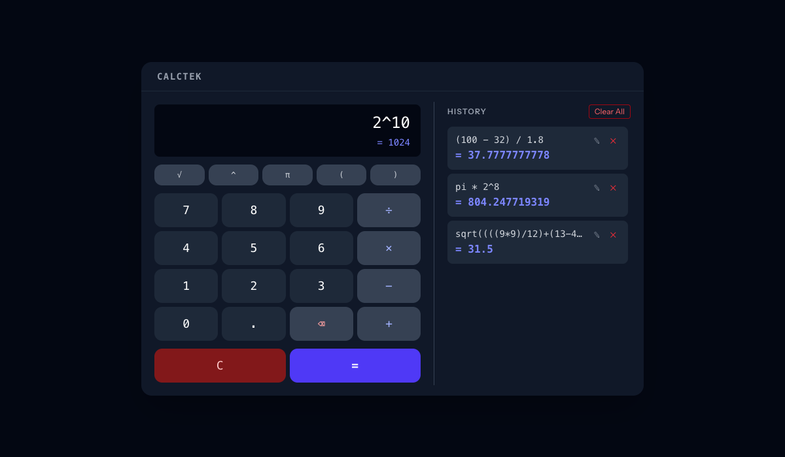

# CalcTek

A session-scoped calculator built with Laravel 12, Inertia.js v2, and Vue 3. Evaluates mathematical expressions in real-time, persists a full history per session, and supports editing or deleting past entries.



---

## Features

- **Live preview** — expression is evaluated client-side as you type using [mathjs](https://mathjs.org/), showing the result or an inline error before you submit
- **Full numeric keypad** — digit buttons, operators (`÷ × − +`), function row (`√ ^ π ( )`), and backspace
- **History tape** — every calculation is saved per session; edit or delete individual entries, or clear all at once
- **Session-scoped** — each visitor's history is isolated; unauthorized edits or deletes return `403`
- **Known tradeoff** — abandoned session rows are not automatically purged; a scheduled `model:prune` using Laravel's `Prunable` trait would clean up stale data in a production deployment
- **Complex expressions** — supports chaining, parentheses, exponentiation, square root, and π (e.g. `sqrt((((9*9)/12)+(13-4))*2)^2`)

---

## Tech Stack

| Layer | Technology |
|-------|-----------|
| Backend | PHP 8.4 · Laravel 12 |
| Frontend | Vue 3 · Inertia.js v2 · TypeScript |
| Styling | Tailwind CSS v4 |
| Database | SQLite |
| Routing | Laravel Wayfinder (type-safe TS bindings) |
| Testing | Pest v4 · Vitest · Browser tests |
| CI | GitHub Actions (PHP 8.4 + 8.5) |

---

## Architecture

### Backend

#### `CalculationController` — `app/Http/Controllers/CalculationController.php`

Handles all calculation CRUD operations. All routes are session-scoped — users can only read, edit, or delete their own calculations.

| Method | Route | Description |
|--------|-------|-------------|
| `index()` | `GET /` | Loads all calculations for the current session and renders the `Calculator` Inertia page |
| `store()` | `POST /calculations` | Validates and saves a new calculation |
| `update()` | `PUT /calculations/{calculation}` | Validates and updates an existing calculation (403 if session mismatch) |
| `destroy()` | `DELETE /calculations/{calculation}` | Deletes a single calculation (403 if session mismatch) |
| `destroyAll()` | `DELETE /calculations` | Deletes all calculations for the current session |

#### Form Requests

| Class | File | Rules |
|-------|------|-------|
| `StoreCalculationRequest` | `app/Http/Requests/StoreCalculationRequest.php` | `expression`: required, string, max 500 chars · `result`: required, numeric |
| `UpdateCalculationRequest` | `app/Http/Requests/UpdateCalculationRequest.php` | Same rules as store |

#### `Calculation` Model — `app/Models/Calculation.php`

| Field | Type | Notes |
|-------|------|-------|
| `id` | integer | Auto-increment primary key |
| `session_id` | string | Laravel session ID — hidden from API responses |
| `expression` | string | Raw expression string e.g. `2 + 2` |
| `result` | float (stored as `decimal(30,10)`) | Evaluated result |
| `created_at` / `updated_at` | timestamp | Managed by Eloquent |

**Scope:** `scopeForSession(Builder $query, string $sessionId)` — filters records to the current session.

---

### Frontend

#### `Calculator.vue` — `resources/js/pages/Calculator.vue`

Single-page UI rendered via Inertia, split into two panels inside a unified card:

**Calculator panel (left)**

- LCD-style display with the expression input aligned right
- Live result (`= value`) or error shown below the input as you type
- Function row: `√` `^` `π` `(` `)`
- 4×4 numeric keypad with `⌫` backspace; operators highlighted in indigo
- Bottom row: `C` (clear) · `Cancel` (edit mode only) · `=` / `Update`
- `Editing` badge appears on the display when a history entry is loaded

**History panel (right)**

- Lists all calculations for the session, most-recent first
- Each entry shows the expression on one line and `= result` on the next
- `✎` — loads the expression back into the calculator for editing
- `✕` — deletes that single entry
- `Clear All` — removes all history entries
- Empty state: "No history yet."

**Key reactive state:**

| Ref | Purpose |
|-----|---------|
| `expression` | Bound to the text input |
| `liveResult` | Evaluated result shown in preview |
| `liveError` | Error string (`Invalid expression` / `Cannot divide by zero`) |
| `editingId` | ID of the calculation being edited, or `null` |
| `storeForm` / `updateForm` | Inertia `useForm` instances for POST and PUT requests |

Routes are called via [Laravel Wayfinder](https://github.com/laravel/wayfinder) type-safe functions imported from `@/actions/App/Http/Controllers/CalculationController`.

---

## Setup & Running the Project

### Requirements

- PHP 8.4+
- Composer
- Node 22+

### Quick Start

```bash
# Install dependencies, copy .env, generate key, run migrations, build assets
composer setup

# Start all dev services (PHP server, queue, logs, Vite)
composer run dev
```

> **Note:** The `setup` script runs `artisan migrate --force`, which bypasses the production confirmation prompt. This is intentional for local and CI environments. In production, run migrations through a proper deployment pipeline without `--force`.

The app will be available at `http://localhost:8000`.

### With Laravel Sail (Docker)

**Requirements:** Docker Desktop

```bash
composer install
cp .env.example .env
php artisan key:generate
./vendor/bin/sail up -d
./vendor/bin/sail artisan migrate
```

The app will be available at `http://localhost`.

---

## Running Tests

### Full PHP test suite

```bash
php artisan test --compact
```

### PHP tests with coverage

```bash
php artisan test --compact --coverage --min=100
```

### PHP type coverage

```bash
./vendor/bin/pest --type-coverage --min=100
```

### Vue component tests with coverage

```bash
npm run test:vue:coverage
```

### Run a specific test

```bash
php artisan test --compact --filter=YourTestName
```

### Mutation testing (local only)

```bash
./vendor/bin/pest --mutate --parallel
```

Mutation tests are not run in CI due to runtime cost but can be run locally to verify test suite effectiveness.

### Linting

```bash
# PHP (Pint)
composer run lint

# TypeScript / Vue (ESLint)
npm run lint
```

---

## CI

GitHub Actions runs the full test suite on every push/PR to `main`, `master`, and `develop`. See [`.github/workflows/tests.yml`](.github/workflows/tests.yml).

The pipeline runs against **PHP 8.4** (stable) and **PHP 8.5** (experimental, `continue-on-error: true`) in parallel. Testing against the next PHP version early catches deprecation warnings and compatibility issues before they accumulate, keeping technical debt minimal.

---

## Local GitHub Actions Runner (Docker)

To run CI jobs locally using a self-hosted Docker runner:

```bash
cp .env.runner.example .env.runner
# Edit .env.runner with your GitHub PAT, REPO_OWNER, and REPO_NAME

docker compose -f docker-compose.runner.yml up --build
```
